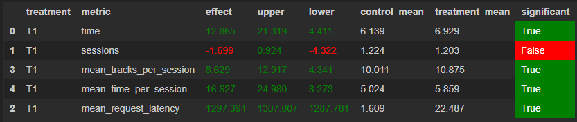

# Отчёт

## Идея

Первоначальной идеей стало добавление истории треков, чтобы не давать пользователю слушать один и
тот же трек повторно. Но, видимо из-за большого количество треков, это не дало никакого эффекта.

Затем мне пришла мысль: если предыдущий трек был неудачным, то брать рекомендацию на основе
понравившихся старых треков пользователя. Но, как оказалось, такую идею уже много кто реализовал,
так как тот факт, что рекоммендер не учитывает то, что трек не понравился пользователю, является
довольно очевидным.

Поэтому мной было принято решение взять рекомендации предыдущего трека и выбрать из них самый
популярный. К счастью, это помогло улучшить результаты, не сильно, но все же.

## Детали реализации

`__init__` вычисляет популярность топовых треков в каталоге.

Популярность рассчитывается как `1 - (i / общее количество треков)`, где `i` — это индекс трека из
списка популярных треков.

Принцип работы рекоммендера следующий:

Фильтруем треки, которые пользователь уже прослушал, и вычисляем популярность оставшихся
рекомендованных треков. Затем выбираем трек с наибольшей
популярностью и возвращаем его в качестве рекомендуемого трека.

## Результаты



# Экстра

## Как запускал

Ничего особенного, просто запускал как в README.md из sim.
```bash
python sim/run.py --episodes 1000 --config config/env.yml multi --processes 4
```

## Ссылка на репозиторий

https://github.com/KhoDis/recsys-itmo-spring-2023

